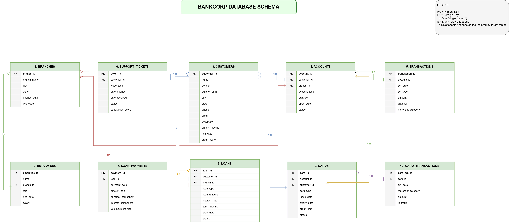
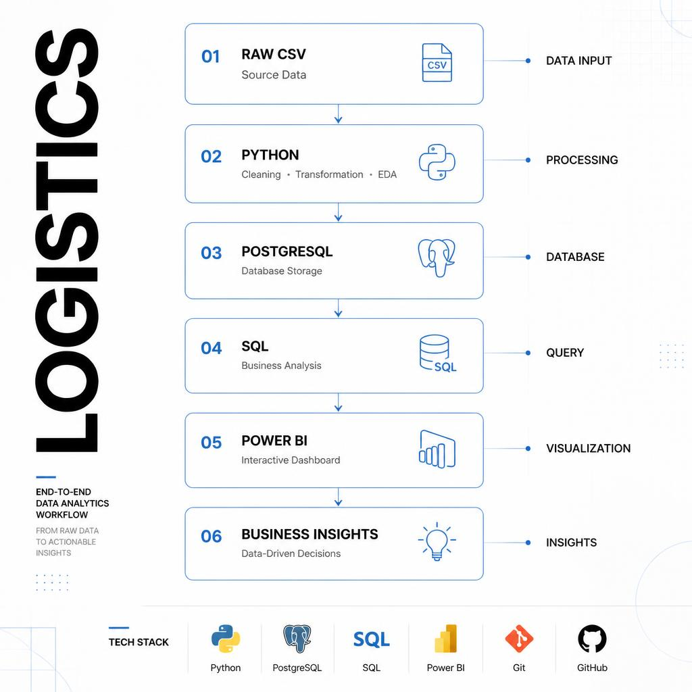

## 🚚 Logistics & Supply Chain Data Analysis — Revenue, Delivery & Warehouse Performance

Analyzing orders, shipments, warehouses, and carriers across a pan-India logistics network to uncover revenue drivers, delivery performance, and inventory risk using SQL, Python, and Power BI.

### 📌 Table of Contents

- [Overview](#overview)
- [Objective](#objective)
- [Dataset](#dataset)
- [Tools & Technologies](#tools--technologies)
- [Project Structure](#project-structure)
- [Database Design](#database-design)
- [Exploratory Data Analysis (EDA)](#exploratory-data-analysis-eda)
- [SQL Analysis](#sql-analysis)
- [Key Findings](#key-findings)
- [Sechma](#sechma)
- [Dashboard](#dashboard)
- [Business Recommendations](#business-recommendations)
- [Project Workflow](#project-workflow)
- [Data Notes & Challenges](#data-notes--challenges)
- [How to Run This Project](#how-to-run-this-project)
- [Author & Contact](#author--contact)

### Overview

This project analyzes a multi-table logistics/supply-chain dataset — customers, orders, order items, products, warehouses, carriers, shipments, and inventory — to understand where revenue comes from, how reliably orders get delivered, and where warehouse capacity is under strain. A full pipeline was built: a normalized PostgreSQL schema (`Data/schema.sql`), Python for merging the tables and running EDA (`Python/`), business-question SQL analysis (`Sql/`), and a 7-page interactive Power BI dashboard.

### Objective

A logistics network generates data at every handoff — customer to warehouse, warehouse to carrier, carrier to doorstep — and each handoff is a place profitability or customer trust can leak out. The goal of this project is to trace revenue back to its source (which customers, states, and product categories drive it), measure how well orders are actually being fulfilled (on-time rate, delay days, cancellations/returns), and flag where warehouses are overstretched — so the findings can support decisions on carrier selection, warehouse capacity, and inventory replenishment.

### Dataset

Source: a synthetic but business-realistic relational dataset (documented in `Data/README.md`), generated with deliberate seasonality and business logic rather than random noise.

**Size:** ~356 MB across 8 CSV files (tracked via Git LFS)

| File | Rows | Approx. Size | Description |
|---|---:|---:|---|
| customers.csv | 50,000 | 3.3 MB | Retail / Wholesale / Corporate customers |
| products.csv | 2,000 | 0.1 MB | 10 categories, realistic price/weight |
| warehouses.csv | 25 | <0.1 MB | Fulfillment centers in major Indian cities |
| carriers.csv | 20 | <0.1 MB | Real-style Indian/global carrier names |
| orders.csv | 1,800,000 | 119.7 MB | Jan 2022 – Dec 2025 |
| order_items.csv | 3,962,138 | 134.7 MB | 1–5 line items per order |
| shipments.csv | 1,674,566 | 96.8 MB | One per non-cancelled order |
| inventory.csv | 50,000 | 1.6 MB | One row per warehouse × product |
| **Total** | | **356.1 MB** | |

Business logic baked into the data, per `Data/README.md`:
- **Seasonality** — order volume is weighted higher in Oct/Nov (Diwali) and Dec (year-end), lower in the Apr–Jun off-season, with ~10–12% YoY growth from 2022 → 2025
- **Order status mix** — ~85% Delivered, ~7% Cancelled, ~7% Returned, plus a small still-open tail concentrated in the last 20 days of the window
- **Logical missingness** — `actual_delivery_date` is NULL only for Cancelled, Processing, and In Transit orders, exactly where a real delivery date wouldn't exist yet
- **Geography-driven logistics** — `distance_km` is computed via the haversine formula between each customer's city and their assigned warehouse (70% nearest-warehouse, 30% cross-region), and transport mode/shipping/fuel cost scale with that distance
- **Customer-type economics** — Retail buys 1–3 units with little/no discount; Wholesale buys 5–20 units at 5–15% off; Corporate buys 10–50 units at 10–20% off

### Tools & Technologies

- **Python** (Pandas, Matplotlib, Seaborn) — merging all 8 tables and exploratory analysis
- **PostgreSQL** — relational schema, indexing, and business-question SQL
- **Power BI** — 7-page interactive dashboard
- **GitHub / Git LFS** — version control and large-file storage for the dataset

### Project Structure

```
Logistics_data_analysis/
│
├── Data/                        # 8 logistics CSVs (Git LFS) + schema + dataset README
│   ├── customers.csv
│   ├── products.csv
│   ├── warehouses.csv
│   ├── carriers.csv
│   ├── orders.csv
│   ├── order_items.csv
│   ├── shipments.csv
│   ├── inventory.csv
│   ├── schema.sql
│   └── README.md
│
├── Python/                      # Merge + EDA scripts
│   ├── Insert.py
│   └── EDA.py
│
├── Sql/                         # Business-question SQL analysis
│   ├── 01_Customer_Analysis.sql
│   ├── 02_Sales_Analysis.sql
│   └── 03_Product_Analysis.sql
│
├── Schma/                       # Database schema diagram
│   ├── Schema.drawio.xml
│   ├── Schema.drawio.png
│   └── Schema.drawio.svg
│
├── Power bi/                    # Dashboard file + page exports
│   ├── Dasbhored.pbix
│   ├── Logo.webp
│   ├── Executive.png
│   ├── Customer.png
│   ├── Porduct.png
│   ├── Warehouse.png
│   ├── Shipment.png
│   ├── Trends.png
│   └── Insights.png
│
├── Project Report.docx          # Full project report
├── README.md                    # Readme
├── Summary.md                   # One-page project summary
└── Work Flow.png                # End-to-end pipeline diagram
```

### Database Design

All 8 tables are modeled in PostgreSQL (`Data/schema.sql`) with primary keys, foreign keys, `CHECK` constraints on categorical fields, and indexes on the join/filter columns that the analysis leans on most.

```
customers (1)───< orders (M) >───(1) warehouses
                     │
                     ├───< order_items (M) >───(1) products
                     │
                     └───< shipments (0..1) >───(1) carriers

warehouses (1)───< inventory (M) >───(1) products
```

A few schema details worth calling out:
- `orders.order_status` is constrained to `Delivered / Cancelled / Returned / In Transit / Processing`, and `shipments.delivery_status` to `Delivered / Returned / In Transit / Pending`
- Cancelled orders intentionally have **no shipment row** — `shipments.order_id` only exists for orders that actually shipped
- `inventory` has a `UNIQUE (warehouse_id, product_id)` constraint — one stock record per product per warehouse
- Indexes sit on `orders.customer_id`, `orders.warehouse_id`, `orders.order_date`, `orders.order_status`, both foreign keys on `order_items` and `shipments`, and both foreign keys on `inventory`

### Exploratory Data Analysis (EDA)

`Python/EDA.py` merges all 8 tables into a single master dataframe (customers → orders → order_items → products → inventory → shipments → carriers → warehouses) and profiles it — shape, dtypes, missing values, duplicates — before engineering a `Revenue` column, a `Month` column for trend analysis, and `processing_days` (order date to shipment date). From there it charts: transport mode distribution, shipping/distance/fuel cost by customer state, rating by transport mode, discount by category, top-selling products, processing time by transport mode, monthly order and revenue trends, a full numeric correlation heatmap, and revenue by transport mode / category / state.

### SQL Analysis

Three scripts cover customer, sales, and — more broadly than the filename suggests — product, warehouse, and shipment analysis:

| Script | Focus | Example business question answered |
|---|---|---|
| 01_Customer_Analysis.sql | Customers | Top 10 customers by revenue, highest-revenue customer type, top revenue cities/states, repeat vs. one-time customers, average order value by customer type, return rate by customer type |
| 02_Sales_Analysis.sql | Sales trends | Orders per month, month-over-month running revenue, highest-sales month, order status breakdown, cancellation %, return % |
| 03_Product_Analysis.sql | Product, Warehouse & Shipment | Top products/categories by revenue and units sold, Pareto (80/20) revenue contribution by product, return rate by category, warehouse order/revenue/inventory leaders, low-stock and replenishment-frequency warehouses, warehouse utilization, carrier shipment counts, on-time delivery rate by carrier, most-used transport mode, cost per km by transport mode |

### Key Findings

*(Figures below are read from the exported Power BI dashboard pages and cross-checked against `Data/README.md` and the SQL logic; approximate where noted.)*

**Network-Wide Scale**
- ~₹228.58 billion in total revenue across 1.8 million orders, 1,674,566 shipments, and 50,000 customers
- Average revenue per customer works out to roughly ₹4.57M, consistent with total revenue ÷ total customers
- 25 fulfillment centers and 20 carriers keep the whole network moving

**Customers**
- Revenue by customer type is **not** proportional to order volume: **Corporate** customers generate the most revenue (~₹119.9bn), ahead of **Wholesale** (~₹69.3bn) and **Retail** (~₹39.4bn) — matching the dataset's built-in logic that Corporate orders are larger (10–50 units) and more heavily discounted, but still worth more per order
- A dedicated SQL query separates one-time customers from repeat customers (`having count(*) = 1` vs. `> 2`), and return rate is broken out by customer type — useful for spotting which segment is costliest to serve

**Sales & Order Status**
- Of ~1.8M orders, roughly 1.52M are Delivered, with Cancelled and Returned each sitting around 120–130K — closely matching the dataset's documented ~85% / ~7% / ~7% split
- Monthly order volume swings from a low of ~120K (April–June off-season) up to a peak of ~206K (October–December, Diwali and year-end) — the seasonality baked into the dataset shows up clearly on the dashboard

**Products & Categories**
- Revenue is concentrated at the top: **Electronics** (~₹78bn) and **Home Appliances** (~₹73bn) dominate category revenue, with a steep drop-off toward Furniture, Apparel, Automotive Parts, Toys & Games, Beauty & Personal Care, Groceries, and Books & Stationery
- This is the inverse of purchase *frequency* — Groceries and Apparel are the most-ordered categories, but Electronics and Appliances carry the highest price tags, so they win on revenue despite lower order counts
- The top 10 products by revenue (laptops, smartwatches, wireless earbuds, refrigerators, Bluetooth speakers, power banks, vacuum cleaners, water purifiers, mixer grinders) are tightly clustered between roughly ₹727M–₹754M each — no single blockbuster product, just broad-based electronics/appliance demand

**Warehouses**
- Stock levels vary widely across the 25 centers — from roughly 265K units at the smallest (Chennai, Jaipur) up past 1.3M units at the largest (Chandigarh) — against listed storage capacities of 50,000–250,000, so utilization reads well above 100% at every warehouse shown, suggesting "capacity" here is tracked in a different unit than raw stock count rather than a literal ceiling
- Guwahati, Visakhapatnam, and Vadodara top the utilization/inventory-value leaderboard, each holding upward of ₹6.3bn in inventory value

**Shipments & Delivery**
- Average shipping cost sits at ~₹5.53K per shipment, with an average delivery delay of just 0.43 days once every shipment (on-time and late) is blended together
- On-time delivery counts are spread fairly evenly across carriers — Container Corporation of India (CONCOR), Indian Railways, TCI Express, Rivigo Logistics, DTDC Courier, Gati, XpressBees, Shadowfax, Ecom Express, and Safexpress all cluster in the ~106K–113K range — no single carrier dominates the network

**Geography**
- Maharashtra is the clear #1 state by revenue (~₹39.7bn, ~310K orders, ~289K shipments), followed by Gujarat (~₹25.3bn), Tamil Nadu (~₹20.4bn), Karnataka (~₹19.0bn), West Bengal, Uttar Pradesh, Telangana, Delhi, Madhya Pradesh, and Punjab rounding out the top 10

### Sechma

All the files, how they are connected to each other, and which fields are the primary keys and foreign keys are defined in the following image.



### Dashboard

The Power BI dashboard (`Power bi/Dasbhored.pbix`) has 7 pages with consistent left-hand navigation and Year/State filters. It's branded "Blue Dart" in the header on every page.

**Executive Dashboard** — total revenue, orders, shipments, and customers, revenue by customer type, orders by status, and monthly order trend


**Customer** — customer count, repeat-customer metrics, revenue by customer type, spending pattern scatter, and top 10 customers by revenue


**Product** — total products, quantity sold, best-seller, top 10 products by revenue, and revenue by category


**Warehouse** — per-warehouse stock quantity vs. storage capacity, a map of fulfillment centers, and inventory value by warehouse


**Shipment** — total/delivered shipments, average shipping cost and delay, cost by transport mode, delivery status split, and on-time delivery count by carrier


**Trends** — revenue by state (table), monthly order volume trend, and monthly revenue trend


**Insights** — top 10 warehouses by utilization/inventory value, top 10 products by stock vs. reorder level, plus a business-insights and recommended-actions panel


The database schema is diagrammed in `Schma/Schema.drawio.png`.

### Business Recommendations

- **Lean into Corporate accounts.** They're the smallest customer segment by count but the largest by revenue — a dedicated account-management or bulk-order incentive program here likely has the highest ROI of any customer-side lever
- **Watch the Cancelled/Returned tail.** ~14% of orders don't end in a clean delivery; since return rate is already broken out by customer type and category in the SQL scripts, use those results to target the specific segments driving it rather than treating cancellations/returns as a flat cost
- **Plan capacity around the Oct–Dec surge, not the annual average.** Order volume nearly doubles from the April–June trough to the October–December peak — warehouse staffing, carrier contracts, and inventory reorder points should flex with that seasonality rather than a flat monthly plan
- **Double down on Electronics/Appliances fulfillment reliability.** These categories drive the bulk of revenue despite lower order frequency, so a delay or stockout here has an outsized revenue impact compared to a Groceries or Apparel delay
- **Re-examine warehouse capacity vs. actual stock.** Every warehouse shown on the Insights page reports utilization well above 100%, which is either a genuine overstock risk or a sign the `storage_capacity` field needs to be interpreted in different units before it's used for planning — worth clarifying before acting on it
- **Finish the Insights page.** The "Key Business Insights" and "Recommended Actions" panels on the Insights dashboard page are still template placeholders (e.g. `[State Name]`, `[X% growth/decline]`) rather than filled-in text — an easy, high-visibility fix since the underlying numbers to fill them in already exist elsewhere on the dashboard


### Project Workflow


### Data Notes & Challenges

- The dataset is pre-generated and already clean (see `Data/README.md`), so the engineering focus here was schema design, relational integrity, and query correctness rather than null-handling or de-duplication
- The full ~356 MB / ~7.5M-row dataset is tracked via **Git LFS**, not committed as plain CSV — `git lfs pull` is required before the SQL scripts or `Insert.py` will have real data to work against
- `Sql/03_Product_Analysis.sql` is broader than its filename — it actually covers Product, Warehouse, and Shipment & Delivery analysis in one file, worth knowing if you're looking for a specific query
- Both `Python/Insert.py` and `Python/EDA.py` currently point at a local Windows path (`d:\Data_Set\30_Logistics\Data\...`) — update these to your own `Data/` folder path before running
- The Insights dashboard page's recommendation panel still contains unfilled bracket placeholders (see Business Recommendations above) rather than computed values
- Warehouse "storage_capacity" and "stock_quantity" are on noticeably different scales (utilization reads well above 100% everywhere), so treat warehouse utilization figures as directional rather than literal until that's clarified

### How to Run This Project

1. Clone the repository:
   ```
   git clone https://github.com/Vivek7ok/Logistics_data_analysis.git
   ```
2. Pull the LFS-tracked data:
   ```
   cd Logistics_data_analysis
   git lfs pull
   ```
3. Create a PostgreSQL database and run the schema:
   ```
   psql -d your_database -f Data/schema.sql
   ```
4. Load the CSVs into PostgreSQL (update the file path in `Python/Insert.py` first):
   ```
   python Python/Insert.py
   ```
5. Run the SQL analysis scripts in `Sql/` (01 → 03) against the loaded database for business-question results.
6. Run exploratory analysis (update the file paths in `Python/EDA.py` first):
   ```
   python Python/EDA.py
   ```
7. Open the dashboard:
   ```
   Power bi/Dasbhored.pbix
   ```

### Author & Contact

Vivek
Data Analyst
🔗 [GitHub](https://github.com/Vivek7ok)
